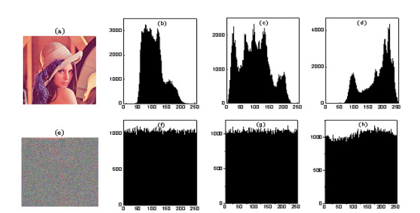
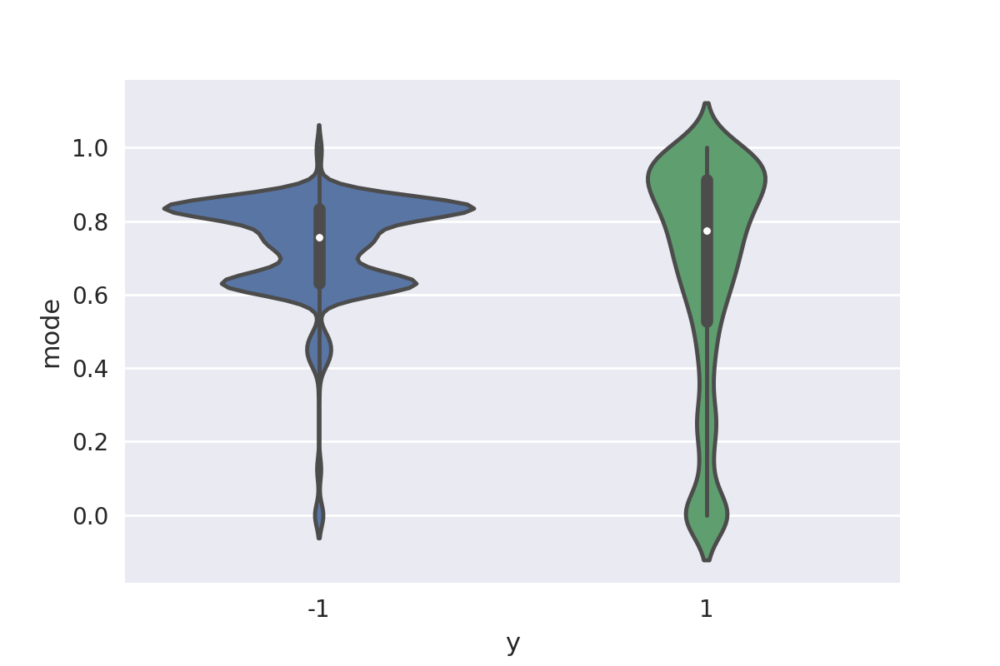

# Introduction
## Theory

In cybersecurity, one of the branches of analytics that is gathering strength is to analyze the behavior of users, machines, services, etc. One way would be to model the ports' behavior depending on whether traffic passing through it is encrypted or not. If a time series analysis process was performed, whose value is the percentage of encrypted traffic passing through each port, anomalies could be detected in many Cyber Kill Chain stages.

In this repository the first step is taken, an algorithm that determines if a session is encrypted is offered. To fulfill this purpose, the network protocol it uses can be used as a base, which is not reliable, since encryption layers can be added regardless of the protocol used. We would also have to assume that the tools that are available understand perfectly all the protocols and can read their headers, even if the protocols are not public like the one used by Citrix. Also keep in mind that as new versions of the protocols come out, the tools would need to be updated so the protocols can be understood.

In addition, encryption can be confused at a glance with serializations, encodings or protocol headers that can not be interpreted by PCAPS parsing tools (Wireshark, Scapy, etc.).

A very extended tool to determine whether a file or a string is encrypted is <a href="http://www.fourmilab.ch/random/"> Ent </a>, which provides the following metrics:

- Entropy
- Chi-square Test
- Arithmetic Mean
- Monte Carlo Value for Pi
- Serial Correlation Coefficient

A good technique to know whether a file is encrypted, is to calculate a probability distribution with the bytes it contains. In the paper <a href="https://www.researchgate.net/publication/50392274_Substitution-diffusion_based_Image_Cipher?_sg=tGAmmy34BimyDZ2PgSk-pPO_aZxQG7cUFF_sRmSelPmf0gYLs7ocBt4Ew0NyuSgRyu3VZFMbhg"> of Narendra  K Pareek, Vinod Patidar and Krishan K Sud called *'Substitution-diffusion based Image Cipher'* </a> shows how the probability distribution of the bytes of an image changes when it is encrypted.
  

    

It is observed that the distribution is flattened, becoming much more uniform than when they are unencrypted, which implies that each byte would be equiprobable and the average would be centered. This makes the metrics proposed by Ent very effective to know whether a file or a string is encrypted, since many of them are based on measuring the uniformity of the probability distribution of the bytes that make up the file in question.

## Practise

The theory says that an encrypted content should follow a uniform distribution. However, in the case of network packets, it is not so simple to observe for various reasons:
- Headers of the application layer protocols not properly parseed skew the distribution, putting, in most cases, many bytes to 0.
- Content encrypted but very small, so only one or several peaks are observed.
- A TCP session always starts with a handshake that never goes encrypted, but then they can exchange encrypted content. Giving a result per session will not result in a uniform distribution.

Below is an example of how the SMB3 protocol shows some of the mentioned problems. This protocol contains data in your payload encrypted with AES-128-CCM.

There are protocols of the application layer whose headers do not understand either of them. As seen in the image below, the payload includes the red area, which corresponds to the NetBios layer, when the relevant area is the green one. It should be noted that most of the bytes that are included are unduly zeros.
It is the deepest payload (that of the application layer) to which both Scapy and Wireshark do not allow access in many cases.

  

In the case of the PCAP with packets whose application layer uses the SMB3 protocol, which contains encrypted data, the probability distribution can be visualized, which theoretically should be uniform, since the data is encrypted. However, headers produce a distortion in the probability distributions, as seen in the following image.

  

 
One way to prevent these distortions from affecting the algorithm's effectiveness is to eliminate certain values from the distribution. The result is as follows:

  

In this way, it is achieved that the algorithm can identify whether a TCP or UDP session is encrypted or not. In the training stage the characterization will be done by packets, since the it is much more refined than when the training is made per session.

Although it is true that the variables that measure uniformity are good variables, other variables must be included to understand the form of the real probability distribution. For example, an unencrypted payload should have a majority of printable ASCII characters, even if the distortion caused by the protocol headers of the application layer uses non printable characters.

# Training stage
## Training data

The training data is created using a traffic sample of BBVA Central Services buildings. These are in the form of a PCAP file, which is more than 4 GB.
### Descriptionn

In this stage, there are packets that use different protocols. To filter them, Wireshark filters are used (also applicable to TShark). All the packets used in the training have been analyzed thoroughly before. Including a false label in this stage will lead to bad results. It is not necessary to use too many examples, since Naive Bayes trains well with few data. The protocols used for training are the following:

- **TELNET**: not encrypted
- **SMB**: encrypted
- **SSH**: encrypted
- **SSL**: encrypted
- **HTTP**: not encrypted 

### PCAPS
In order to reproduce this study, the filters that were applied to the building traffic PCAP to obtain the training data are provided.

- **TELNET**: telnet.data
- **SSH**: ssh.encrypted_packet
- **SSL**: ssl and not ssl.handshake
- **HTTP**: http and not http2 and not ssl and not (tcp.srcport == 8080 or  tcp.srcport == 80 )

In the case of *HTTP*, some port filters are included in order to remove some encrypted sessions from the building traffic sample. They can not be extrapolated to any PCAP.

To read the pcaps, you must clone the repository of <a href="https://github.com/dataEverything/file_processing"> file_processing </a> where there are functions that abstract the necessary functionalities to execute the algorithm contained in the present repository.

## Feature analysis
The following pre-processing has been carried out on the variables:
- Normalization between 0 and 1 to all the variables.
- Logarithmic transformation over: chi2, mode and most_ascii
- Exponential transformation over: entropy_cut

### Pearson chi-square test over the entire distribution

This test measures the discrepancy between an observed distribution and a uniform distribution, which would be the theoretical distribution in case the data were encrypted.

The higher the chi-square value, the less likely it is that a uniform distribution follows (that the null hypothesis is verified). In the same way, the closer the value of chi-square approaches zero, the more adjusted both distributions are.

In the encrypted packets, it is observed that chi2 is usually quite low. In the case of non-encrypted ones, there is a greater dispersion. This corroborates the hypothesis that the encrypted packets follow a uniform distribution.

  

### Shannon entropy over the entire distribution

Entropy measures the degree of uncertainty or homogeneity in information. Since a uniform distribution is homogeneous, entropy is an important feature to determine if data is encrypted.

The entropy in the encrypted packets is very high. In the unencrypted it is less high. The difference is not too marked by the problem of pairing with the headers.

  

### Shannon entropy over part of the distribution 

This variable measures the same as the previous one, but eliminates the following positions:

- First
- Second
- Last
- Mode (most repeated value once those mentioned above have been removed)

The reason why this variable exists is that PCAPS parsing tools do not have certain protocols of the application layer implemented and read their headers as if they were the payload. This causes peaks in encrypted packets that make the entropy decrease despite the payload is encrypted.

The entropy_cut variable differentiates the encrypted packets from those that are not because some encrypted ones saw their entropy diminished by the header of the layer 7 protocols, which the PCAPS parsing tools do not implement in some cases.

  

### Mode
Mode is the most repeated byte. At times, it is sometimes usefult to characterize the protocol, as the empty values of headers are often filled with the same bytes. 

Mode has a higher concentration in high values in unencrypted packets.

  

### Variety
The variety counts how many bytes there are in the distribution that are not zero.

The payload variety of a packet is the count of the unique bytes that there are.

  

### Dispersion
The dispersion measures the width of the distribution, taking into account the zeros.

In the encrypted packets, the dispersion is usually maximum. Not only the bytes from 0 to 127 are used, but there are bytes from 0 to 255. In the non-encrypted ones, however, they tend to have a dispersion inside the printable ASCII except in case they are enriched files, such as those of the Microsoft Office suite.

  

### Most_ASCII
Certain bytes belong to the printable ASCII table. If these are used more than the rest, you can indicate that the data is not encrypted.

The variable most_ascii represents the proportion of printable ASCII characters with respect to the rest of the bytes that the payload of the packet contains. In encryption, it is usually very low and higher in non-encrypted ones.

  

### Non_printable
It has been observed that some bytes within the distribution appear frequently in the encrypted data.

The non_printable variable represents the proportion of non-printable bytes with respect to the rest of the bytes that the packet payload contains.

  

### Average
The mean is calculated to detect biases in the distribution.

The average is centered on the case of encrypted packets. This happens in uniform distributions, which is a good sign.

  

### Feature visualization

In general terms, you can see in the graphs the different characterization provided by the variables to the encrypted (green) and unencrypted packets (blue), thus being able to model their behavior.

A separation of the variables in the scatterplots matrix is observed. 

  

# Test stage
Once the variables have been studied, Naive Bayes is used as a classification algorithm. The trained model is saved for later use.

To apply the algorithm, the PCAPS that are contained in the specified route are read. This part has been separated from the rest of the algorithm in order to change the way PCAPS is read, so any message queue system (like Kafka) could be used instead of reading the files of a directory.

After applying Wireshark filters, a packet is selected that is known to be encrypted or not and the session that contains it is extracted. Then the session is re-analyzed, exploring the headers and / or visually to ensure that the provided label is correct. A list with the expected labels is built, given the PCAPS that are provided for the test stage.

Data contained in the test PCAPS:
- **Sessions**: there are TCP and UDP sessions in the PCAPS.
- **Packets with several files**: there are sessions containing non-encrypted files transferred by SMB (not to be confused with SMB3). It is known that these are not encrypted because they can be downloaded in Wireshark with the option *Export Objects / SMB *

Then the payload is extracted from each PCAP giving a result of file per session. That is to say, that each file is labeled instead of labeling a packet, as was done in the training stage, since the objective is to know if a session is encrypted or not. To facilitate the labeling, encrypted PCAPS are saved in different folders of those that are not.

The pre-processing in both cases is the same, so the algorithm could be applied to unlabelled sessions.

## Naive Bayes

It is a probabilistic classifier based on Bayes' theorem and some additional simplifying hypotheses. The parameters used to train this classifier are the characteristics of the distributions of the training set.

In the *NetworkSessionClassification* notebook you can see how the model is applied to each packet, and the result is summarized per session.

## Algorithm

After training the algorithm that detects whether a packet is encrypted or not, you should find a way to give a result per session. To fulfill this purpose, a class that is potentially deployable in production is developed, which is found in the *NetworkSessionClassification* notebook.

The labels of the packets are -1 and 1 to be able to know how encrypted or unencrypted it is, since if the labels of the packets were 0 and 1, one could only know how encrypted it is.

When answering if a session is encrypted or not, the following values are collected:

- **Vector P**: classification of the packet within a session. That will be -1 in the unencrypted packets and 1 in the encrypted ones
- **Vector L**: size of each packet within a session

The product of both vectors is added and the result is normalized with a hyperbolic tangent.

  

The formula that is used to give a result per session is the following:

  

Where:
- *n* is the number of packets that a session contains
- The vector *P* is the vector that contains the size of each packet within the session in bytes.
- The vector *L* is the vector that contains the classification result, which will be 1 or -1.

The prediction will be a value between 1 and -1, since it is normalized by a hyperbolic tangent.
- Not encrypted: -1
- Encryption: 1
- Unknown: 0

## Execution of the algorithm

When the algorithm is applied, the function that returns a list of file paths is called. Each file must contain a single session. This part can be replaced by any other type of entry, as long as a raw PCAP session is passed to the class.

Once, you are given the path where the session to be analyzed is located, the function that reads the file is called and it is passed to the class **SessionClassification** and the results are saved in the list *y_pred* to contrast them with those expected in order to measure the effectiveness of the algorithm. This list will have one element per session.

To give a result per session, multiply the list with the predictions and the list of the sizes of the packets that belong to a session. This is done because there are cases in which a session is not encrypted from the beginning. For example, an encrypted TCP session has a pre-negotiation stage that will not be. However, that session should be classified as encrypted. Usually, negotiation packets are smaller than encrypted data, so size acts like a weight that models encryption in a session.

## Data used for the test stage
The PCAPS used for the test come from the latter part of PCAP sample traffic and traffic from a BBVA server. 

# Results

Although there are false positives and false negatives when classifying the packets, these errors occur when the packets are very small, so these errors are corrected when a session is taken into account as a whole.

## Model metrics
### Confusion Matrix

The following metrics are calculated:
- TNR: 0.97
- TPR: 1.00
- Precision: 0.92
- Recall: 1.00
- F-Measure: 0.96

The matrix of confusion is shown below.

  

### ROC curve

Curve Receiver Operating Characteristic is a graphical representation of the sensitivity versus specificity for a binary classifier system, threshold is varied according to the discrimination. The area under the ROC curve is 0.98.

  

# Conclusion 

It is possible, from a PCAP or raw network traffic, to know whether a session is encrypted or not although not all protocols are implemented by the available PCAPS parsing tools, thus being able to classify any session without doing any previous filtering. This would allow to find out about the behavior of ports, servers, applications, etc. . It could thus detect anomalies that could trigger security alerts in the future.

# Next steps
## Apply the model in streaming
When it comes to training and testing the model, it does not make sense to apply it in real time. It has been tried to apply the model in streaming with Kafka, obtaining good results.

## Filter of sessions without payload at the level of the application layer
False positives are given in packets that only contain protocol headers, such as a *Create Request File* of SMB2. With a better protocol pairing or with an additional filter.

## Characterization by protocol
A study could be made within each protocol of the percentage of encrypted traffic that receives and analyze variations on it. Another option is to add more variables describing the protocol itself, creating a module parallel or subsequent to the encryption algorithm.
